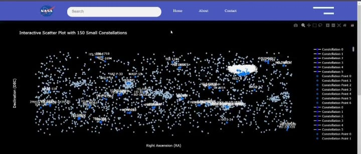
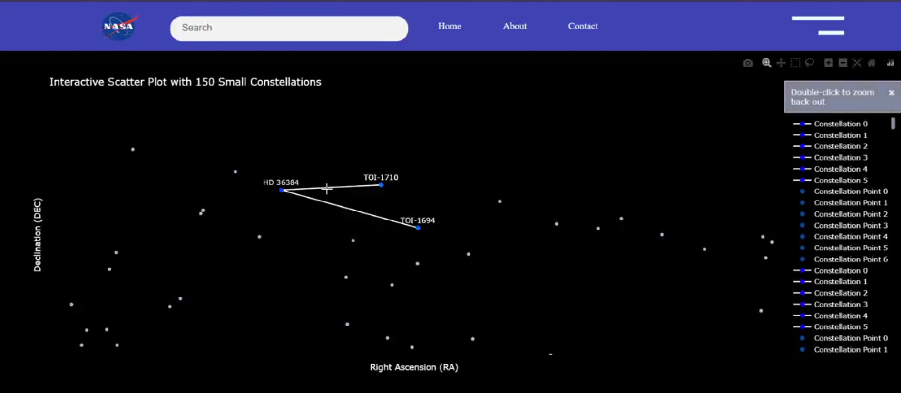

# 🌌 Constellation.AI

### Project Title: Galaxy Star Plot & Constellation Mapping

**Constellation.AI** is an interactive star visualization platform that empowers users to explore celestial constellations in a fully immersive way. Developed for the **NASA Space Apps Challenge 2024**, this full-stack project visualizes over 150 constellations and known exoplanets, blending real astronomical data with an intuitive frontend experience.

---

## 🚀 Why Constellation.AI?

Constellations are more than just patterns in the sky — they represent humanity’s connection to the universe. However, for many, the night sky is just a mass of stars with little meaning. **Constellation.AI** bridges that gap using real data visualizations and educational content to help anyone, anywhere, engage with our galaxy.

**With Constellation.AI, users can:**
- Explore real-time star positions
- Learn about officially recognized constellations
- Discover exoplanets with contextual details

---

## ✨ Key Features

### 🌀 Interactive Star Plot
- Plots over **150 constellations** using RA/DEC coordinates
- Hover to view star and planet names
- Zoom and pan for full galaxy-scale exploration
- Color-coded clusters based on constellation groups

### 🔭 Constellation Discovery Page
- Swipeable planet cards for exoplanets (e.g., Kepler-22b, 55 Cancri e)
- Learn about all 88 official constellations
- Overlays and star-path illustrations
- Fully responsive UI for mobile and desktop

---

## 🧠 Tech Stack

| Component     | Tech Used                        |
|---------------|----------------------------------|
| 🌐 Frontend    | HTML, CSS, JavaScript, Plotly.js |
| 🧪 Data Source | NASA Exoplanet Archive, IAU     |
| 🎨 UI Design   | Figma to Frontend pipeline       |
| 🚀 Hosting     | GitHub Pages / Netlify           |

---

## 🧬 How It Works

1. **Star Plot Engine** – Renders a dynamic galaxy view using celestial coordinates  
2. **Cluster Grouping** – Groups stars into known constellations  
3. **Exoplanet Details** – Planet cards display size, class, orbit, and star origin  
4. **Mobile Optimization** – Clean UI for constellation learning on the go  

---

## 🖼️ Visual Preview

### 🌌 Scatter Plot (Desktop)  

  

  

### 🔍 Constellation Detail (Mobile)  

  

---

## 🔮 Future Improvements

- 🌍 Real-time sky tracking using compass and GPS
- 🔊 Voice-guided constellation identification
- 📡 Live ISS tracking and visibility updates
- 🌗 Moon phase, eclipse, and meteor calendar

---

