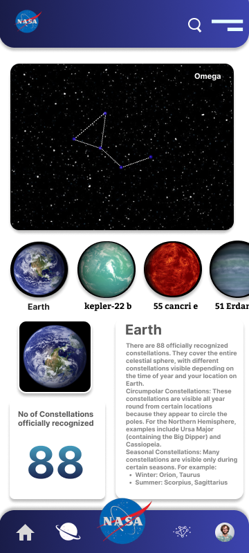

🌌 Constellation.AI
Project Title: Galaxy Star Plot & Constellation Mapping
Constellation.AI is an interactive star visualization platform that empowers users to explore celestial constellations in a fully interactive, immersive way. Developed for the NASA Space Apps Challenge 2024, this full-stack project visualizes over 150 constellations and known exoplanets, blending real astronomical data with intuitive front-end experiences.

🚀 Why Constellation.AI?
Constellations are more than just patterns in the sky — they represent humanity’s connection to the universe. However, for many, the night sky is just a mass of stars with little meaning. Constellation.AI bridges that gap using real data visualizations and dynamic educational content to help anyone, anywhere, understand and engage with our galaxy.

From school students to stargazing enthusiasts, our tool makes it easy to:

Explore real-time star positions

Learn about officially recognized constellations

Discover exoplanets with contextual details

✨ Key Features
🌀 Interactive Star Plot
Plots over 150 small constellations using RA/DEC coordinates

Hover to see names of stars and planets

Zoom & pan for galaxy-scale exploration

Dynamic color-coding based on constellation groupings

🔭 Constellation Discovery Page
Swipeable planet cards for known exoplanets (e.g., Kepler-22b, 55 Cancri e)

Learn about Earth's 88 officially recognized constellations

Visual overlays and star paths for constellation shapes

Responsive UI optimized for mobile and desktop

🧠 Tech Stack
Component	Tech Used
🌐 Frontend	HTML, CSS, JavaScript, Plotly.js
🧪 Data Source	NASA Exoplanet Archive, IAU
🎨 UI Design	Figma to Frontend pipeline
🚀 Hosting	GitHub Pages / Netlify

🧬 How It Works
Constellation Plot Engine
Uses Plotly.js to render a dynamic star map from celestial coordinates (RA & DEC).

Star Cluster Grouping
Stars are grouped into their respective constellations (IAU recognized or custom clusters).

Exoplanet Details
Cards display known exoplanets along with classification, size, and orbital data.

Responsive Mobile View
Dedicated mobile UI displays constellations, planets, and explanations in a scrollable format.

🖼️ Visual Preview
🌌 Scatter Plot (Desktop)

  

🔍 Constellation Detail (Mobile)

  

🔮 Future Improvements
🌍 Integrate real-time sky tracking using device compass and GPS

🔊 Add voice-based constellation identification

📡 Live ISS tracking and planet visibility status

🌗 Moon phase and meteor shower calendars
